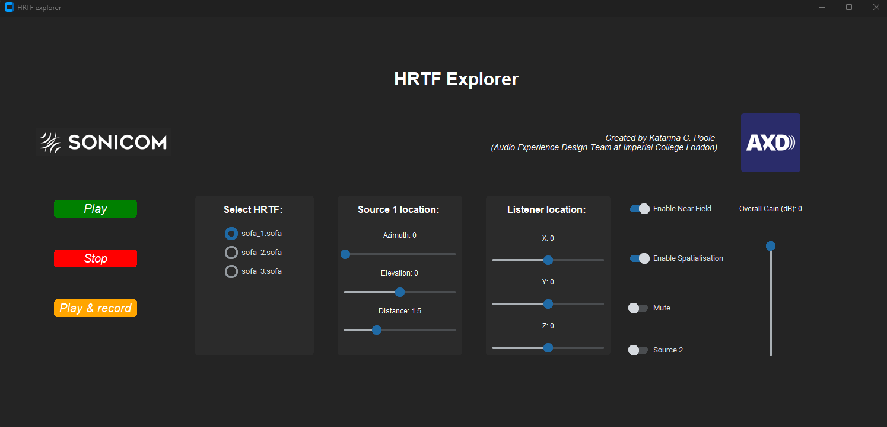
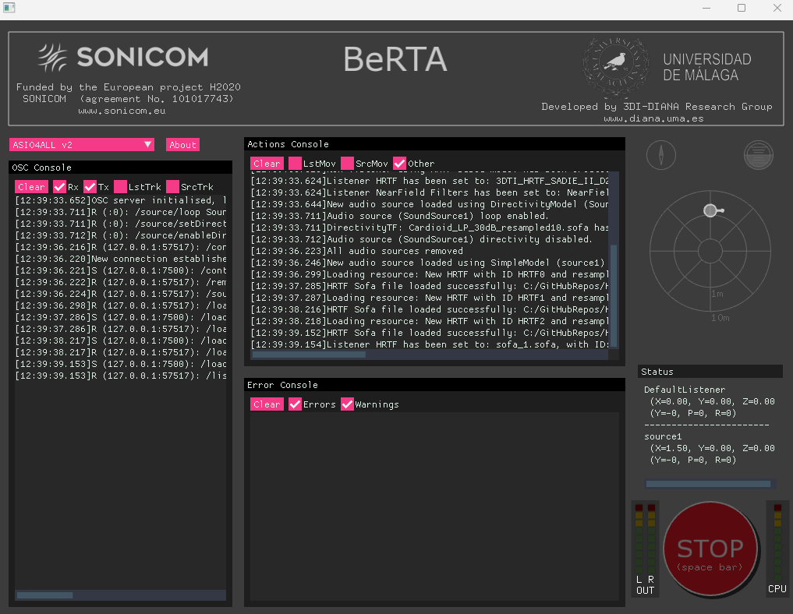

# HRTF Explorer
The HRTF Explorer is a GUI that uses OSC commands to communicate with the Binaural Rendering Toolbox (BRT).

It is primarily an example of how one would use Python (using OSC commands) to render binaural audio using the BRT.

Python gui:

  

BRT application:

  

# Installation
Firstly you should install the latest release of the BRT (currently I have only tested this with v1.3.1) here: https://github.com/GrupoDiana/BRTLibrary/releases/tag/v1.3.1

Then create a virtual environment and pip install the requirements to install the rest of the dependencies:
```
pip install -r requirements.txt
```

You will then need to need to define the absolute paths and HRTFs you want to load in the configuration file (config.yml). This should include the path of the BerTA.exe file in the BRT application. You can load in more or less than three HRTFs at a time but be aware that the more HRTFs you load the longer it will take for the BRT toolbox to finish loading all HRTFs.

```
brt_dir: "C:/Program Files/University of Malaga/BRT Application/BeRTA.exe"

hrtf_dir: "C:/GitHubRepos/HRTF_explorer/hrtfs/"
hrtfs:
  - "sofa_1.sofa"
  - "sofa_2.sofa"
  - "sofa_3.sofa"
```
You can also configure other settings in the explorer here as well if you wish (for example the port the OSC sends and receives on as well as the audio used).

The explorer has some example HRTFs you can use straight out of the box, but if you would like to test out more, the SONICOM dataset has 100 HRTFs in the SOFA format (with more to be released in the future) here: https://www.axdesign.co.uk/tools-and-devices/sonicom-hrtf-dataset

To run the application you will then just need to type the below into the command line whilst in the root directory of the repository and the virtual environment in which you installed the dependencies:
```
python hrtf_explorer.py
```
Then select the correct audio device in the BRT application in the pink drop down near the top left of the program.

You are then free to play and change the settings of the source, listener and HRTF. Enjoy!


# Acknowledgements
This work was created whilst part of of the Audio Experience Design Team (https://www.axdesign.co.uk/) at Imperial College London.

   


The SONICOM project has received funding from the European Union’s Horizon 2020 research and innovation programme under grant agreement no.101017743. The sole responsibility for the content of this project lies with the authors. It does not necessarily reflect the opinion of the European Union. The European Commission is not responsible for any use that may be made of the information contained therein.


 
# License
Copyright (C) 2024  Katarina C. Poole (Audio Experience Design Team at Imperial College London)

This program is free software: you can redistribute it and/or modify
it under the terms of the GNU General Public License as published by
the Free Software Foundation, either version 3 of the License, or
(at your option) any later version.

This program is distributed in the hope that it will be useful,
but WITHOUT ANY WARRANTY; without even the implied warranty of
MERCHANTABILITY or FITNESS FOR A PARTICULAR PURPOSE.  See the
GNU General Public License for more details.

You should have received a copy of the GNU General Public License
along with this program.  If not, see <https://www.gnu.org/licenses/>.